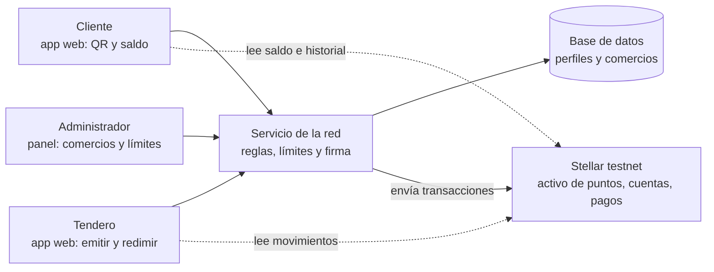

# Product Blueprint

**Nombre del proyecto:** Escriban aquí el nombre

**Repositorio (enlace obligatorio):** [Nombre del repositorio](https://github.com/usuario/repositorio)

> Los campos marcados como *enlace obligatorio* deben ir como enlace en Markdown, con este formato: `[texto del enlace](https://...)`. Reemplacen el texto y la dirección de ejemplo.

---

## Contenido

1. Priorización de historias
2. Propuesta de valor
3. Flujo de usuario
4. Alcance del MVP
5. Lean Canvas
6. Backlog priorizado (Kanban)
7. Arquitectura inicial
8. Uso de Stellar y justificación

---

## 1. Priorización de historias

> Historias elegidas entre las que propuso el equipo y criterio con que se priorizaron. Son las que pasan al backlog. Extensión: breve.

**Criterio de priorización:** Escriban aquí el criterio (por ejemplo, imprescindible / debería / podría / queda fuera).

| Prioridad | Historia | Propuesta por | Por qué entra al backlog |
| :---: | --- | :---: | --- |
| 1 | Como tendero de un comercio participante, quiero registrar una compra y asignar los puntos correspondientes según las reglas de la campaña, para recompensar a mis clientes sin llevar controles manuales. | Esteban Ibarguen | 	Imprescindible: es el origen de todo el valor. |
| 2 | Como cliente de la red, quiero utilizar mis puntos en un comercio aliado diferente de aquel donde los obtuve, para acceder a recompensas útiles en mis compras cotidianas. | Esteban Ibarguen | Imprescindible: es el diferencial frente a los programas aislados.. |
| 3 | Como administrador de la red quiero establecer reglas comunes para la emisión, transferencia, redención y vencimiento de puntos para garantizar un funcionamiento justo y controlado entre los comercios participantes. | German Ochoa | Debería: mitiga el riesgo de ventas falsas. |
| 4 | Como cliente quiero consultar mi saldo e historial de puntos para conocer cuánto valor tengo disponible y cómo lo he utilizado.  | Erik Villarreal | Imprescindible: sin saldo visible el cliente no percibe valor. |
| 5 | Como tendero local, quiero consultar cuántos beneficios he entregado, cuántos han sido utilizados y qué clientes han regresado, para saber si mis campañas generan más compras y tomar mejores decisiones comerciales. | German Ochoa | Debería: responde a la fricción de no conocer el costo. |

*(Agreguen o borren filas según las historias que pasen al backlog.)*

---

## 2. Propuesta de valor

> Qué resultado obtiene el usuario y por qué elegiría esta solución. En qué se diferencia de cómo resuelve hoy. Conecta con el usuario del Problem Brief. Extensión: 150–300 palabras en total.

**Usuario (del Problem Brief):** 

El tendero logra fidelizar a sus clientes, aumentar sus ventas recurrentes y atraer nuevos compradores con una herramienta accesible y compartida. El cliente logra obtener recompensas más útiles porque puede acumular puntos en un comercio y utilizarlos en otro establecimiento participante.

**Resultado que obtiene:** 

La solución busca generar valor tanto para los tenderos como para sus clientes mediante una red de fidelización compartida. Para el tendero, permite incentivar que sus clientes regresen, premiar sus compras y crear promociones sin tener que desarrollar o mantener una aplicación propia. Además, puede atraer nuevos clientes provenientes de comercios aliados, participar en campañas conjuntas y consultar qué promociones generan mejores resultados, reduciendo al mismo tiempo el trabajo manual de administrar los beneficios.

Para el cliente, la propuesta permite acumular beneficios con sus compras y consultar fácilmente el saldo disponible. La principal ventaja es que estos beneficios pueden utilizarse no solo en el comercio donde fueron obtenidos, sino también en otros negocios aliados, haciendo que las recompensas sean más útiles. De esta manera, el cliente evita manejar diferentes tarjetas o programas de fidelización y puede acceder a promociones de comercios cercanos y de confianza, teniendo además mayor claridad sobre sus beneficios, condiciones y fechas de vencimiento.

En conjunto, el resultado es una relación de beneficio mutuo: los tenderos cuentan con una herramienta para fortalecer la fidelización y atraer clientes, mientras que los clientes reciben beneficios más útiles, accesibles y aprovechables dentro de una red de comercios.

**Por qué elegiría esta solución:** 

**El tendero:** elegiría la solución porque puede implementar un programa de fidelización sin desarrollar una aplicación propia, reduciendo costos y trabajo manual. Además, puede crear promociones, conocer sus resultados y participar en una red de comercios que permite atraer nuevos clientes.

**El cliente:** la elegiría porque puede acumular beneficios y utilizarlos en diferentes comercios aliados, sin tener que manejar múltiples tarjetas o programas. Esto hace que las recompensas sean más útiles, cercanas y fáciles de utilizar.

En conjunto, la solución ofrece una alternativa de fidelización más accesible para los tenderos y más útil para los clientes.

**En qué se diferencia de cómo lo resuelve hoy:** 

| **Operación actual** | **Con la solución propuesta** |
| --- | --- |
| El tendero recuerda quién compra con frecuencia. | El sistema registra la participación del cliente. |
| Se entregan descuentos de manera informal. | Las recompensas siguen reglas claras. |
| Las tarjetas físicas pueden perderse. | El cliente consulta sus beneficios por un medio sencillo. |
| Los puntos solo sirven en un negocio. | Pueden utilizarse en comercios aliados. |
| Cada comercio trabaja por separado. | Los comercios pueden crear campañas conjuntas. |
| No se mide el resultado de la promoción. | El tendero consulta emisiones, usos y resultados. |
| El cliente debe recordar varias condiciones. | La red concentra la información de sus beneficios. |

---

## 3. Flujo de usuario

> Recorrido de la persona por la solución de principio a fin, roles y puntos de interacción. Diagrama o secuencia numerada. Extensión: 150–300 palabras.

| Paso | Rol | Qué hace | Punto de interacción |
| :---: | :---: | --- | --- |
| 1 | Tendero | **Recibir** | Recibir la invitación para participar en la red de comercios aliados. |
| 2 | Tendero | **Registrar** | Registrar su tienda con ayuda de un acompañante o mediante un formulario sencillo. |
| 3 | Tendero | **Aprender** | Aprender a entregar beneficios utilizando un código o número de teléfono. |
| 4 | Cliente | **Identificarse** | Identificarse con su número de teléfono o código personal al realizar una compra. |
| 5 | Tendero | **Registrar** | Registrar la compra del cliente de manera rápida. |
| 6 | Sistema | **Asignar** | Asignar los beneficios que corresponden a la compra. |
| 7 | Cliente | **Consultar** | Consultar cuántos beneficios tiene acumulados. |
| 8 | Cliente | **Elegir** | Elegir el beneficio que desea utilizar. |
| 9 | Cliente | **Visitar** | Visitar el mismo comercio u otro negocio aliado. |
| 10 | Cliente | **Solicitar** | Solicitar el descuento, producto o beneficio disponible. |
| 11 | Tendero | **Verificar** | Verificar que el cliente tenga beneficios suficientes. |
| 12 | Tendero | **Aplicar** | Aplicar el beneficio a la compra. |
| 13 | Sistema | **Actualizar** | Actualizar el saldo del cliente después de utilizar el beneficio. |
| 14 | Cliente | **Obtener** | Obtener un descuento, producto o beneficio concreto. |
| 15 | Tendero | **Confirmar** | Confirmar la compra y la utilización del beneficio. |
| 16 | Tendero | **Revisar** | Revisar qué beneficios fueron entregados y qué resultados generaron. |
| 17 | Tendero | **Decidir** | Decidir qué promoción mantener, modificar o suspender. |
*(Agreguen los pasos que hagan falta. Si prefieren, inserten aquí un diagrama.)*

---

## 4. Alcance del MVP

> Funcionalidad central separada de la deseable que queda fuera. Justificación de por qué el recorte sigue entregando valor. Extensión: 150–300 palabras en total.

| Dentro del MVP (funcionalidad central) | Fuera del MVP (deseable, para después) |
| --- | --- |
| **Registro de comercios y clientes:** permitir la creación de cuentas básicas para que tenderos y clientes puedan participar en la red. | **Aplicación móvil nativa completa:** se priorizará una experiencia web sencilla para validar primero el modelo. |
| **Registro de compras y asignación de beneficios:** el tendero podrá registrar compras elegibles y el sistema asignará automáticamente los puntos según las reglas de cada campaña. | **Paneles y analítica avanzada:** reportes avanzados, clasificación de clientes, recomendaciones de campañas y ranking de promociones se incorporarán después de validar el uso básico. |
| **Consulta, verificación y actualización de saldo:** el cliente podrá consultar sus puntos y el tendero verificar el saldo disponible antes de una redención. | **Campañas avanzadas:** campañas conjuntas, beneficios por referidos, campañas patrocinadas y catálogo de recompensas podrán incorporarse en futuras versiones. |
| **Redención de beneficios:** los clientes podrán utilizar sus puntos en el comercio emisor o en comercios aliados participantes. | **Integraciones y automatizaciones:** integración con sistemas de caja y automatización completa de liquidaciones se evaluarán después de validar las reglas operativas. |
| **Historial de movimientos y reglas de campaña:** se registrarán compras, asignaciones, redenciones, vencimientos y ajustes bajo reglas comunes de equivalencia, límites y vencimiento. | **Funciones no esenciales:** chat entre clientes y comercios, encuestas de satisfacción y otras funcionalidades secundarias no hacen parte de la primera versión. |
| **Gestión básica de permisos y soporte:** el administrador controlará quién puede emitir, recibir, revisar o ajustar operaciones y contará con mecanismos básicos para atender reclamos. | **Funciones fuera del modelo inicial:** conversión de puntos a dinero, compra o venta de puntos, programas de crédito y personalización individual avanzada por comercio. |
| **Alcance controlado:** el piloto se implementará inicialmente en una zona o comunidad comercial para validar el modelo antes de una expansión mayor. | **Expansión nacional:** se pospone hasta contar con evidencia de adopción y validar el funcionamiento de la red en un entorno controlado. |

**Por qué el recorte sigue entregando valor:** 

El recorte sigue entregando valor porque conserva el flujo principal de la propuesta: un comercio registra una compra, el cliente recibe puntos, puede consultar su saldo y posteriormente utilizar esos beneficios en el comercio emisor o en un comercio aliado. Además, el historial, las reglas de campaña y los permisos permiten mantener trazabilidad y control sobre las operaciones.

Las funcionalidades de Should Have y Could Have se dejan para etapas posteriores porque ayudan a mejorar la experiencia, generar analítica o automatizar procesos, pero no son indispensables para comprobar si los clientes realmente encuentran valor en acumular y redimir beneficios entre diferentes comercios. De igual forma, funcionalidades como la conversión de puntos a dinero, compra o venta de puntos y programas de crédito se excluyen porque aumentarían considerablemente la complejidad del modelo.

De esta manera, el MVP permite validar primero la hipótesis central: una red compartida de puntos puede generar mayor utilidad para clientes y tenderos que los programas de fidelización independientes, antes de invertir en funcionalidades más avanzadas.

---

## 5. Lean Canvas

> Lienzo de una página con el modelo del producto. Extensión: enlace (obligatorio).

**Enlace al Lean Canvas (obligatorio):** [Lean Canvas del proyecto]([https://escriban-aqui-el-enlace](https://www.canva.com/d/6l0715zO5l9WBcz))

El lienzo debe cubrir: problema, segmento de usuarios, propuesta de valor única, solución, canales, métricas clave, ventaja diferencial y estructura de costos e ingresos.

---

## 6. Backlog priorizado (Kanban)

> Enlace al tablero en GitHub Projects, construido con las historias priorizadas, en columnas y con criterios de aceptación por tarjeta. Extensión: enlace al tablero (obligatorio).

**Enlace al tablero (obligatorio):** [Tablero Kanban en GitHub Projects](https://github.com/users/95xErvit/projects/1)

---

## 7. Arquitectura inicial

> Cómo se conectan las partes (interfaz, lógica, Stellar) y en qué punto entra la red. Diagrama simple en imagen. Extensión: 150–300 palabras en total.

**Diagrama (imagen o enlace):** Escriban aquí el enlace o inserten la imagen.

 
| Capa | Componente | Qué hace |
| :---: | --- | --- |
| Interfaz | Aplicación web para cliente, tendero y administrador. | Muestra el código QR, el saldo, los formularios de entrega y redención y los reportes. |
| Lógica | Servicio de la red y base de datos. | Aplica las reglas (puntos por compra, límite por comercio), relaciona el celular del cliente con su cuenta, arma y firma las transacciones. Guarda fuera de la red los datos personales. |
| Stellar | Activo de puntos, cuentas de emisión, comercios y clientes. | Registra cada entrega y cada redención como un pago y conserva los saldos y el historial. |
 
**En qué punto entra la red:** La red entra en dos momentos: cuando el tendero confirma la entrega de puntos y cuando el cliente confirma una redención. En ambos casos el servicio valida la regla, envía la transacción y solo muestra el resultado cuando la red la confirma. Los saldos y el historial se leen directamente de Stellar, de modo que la base de datos propia no es la fuente de verdad de los puntos: solo guarda perfiles, comercios y configuración. Los datos personales nunca se escriben en la red.

---

## 8. Uso de Stellar y justificación

> Qué componentes de Stellar usaría y por qué cada uno. Apoyado en el criterio de pertinencia del Problem Brief. Extensión: 150–300 palabras en total.

**Criterio de pertinencia (del Problem Brief):** Escriban aquí el criterio en el que se apoyan.

| Componente de Stellar | Para qué lo usamos | Por qué ese y no otra alternativa |
| --- | --- | --- |
| Activo emitido (cuenta emisora y cuenta distribuidora) | Representar el punto de fidelización. | Crear un activo es una función nativa: no exige programar ni auditar un contrato para el MVP. |
| Líneas de confianza con autorización requerida | Permitir que solo comercios y clientes aprobados tengan puntos. | Lleva a la red la aprobación del administrador; evita un mercado abierto y especulativo de puntos. |
| Pagos con memo | Registrar entregas y redenciones con su referencia. | Cada movimiento queda con fecha, origen y destino, verificable por cualquier comercio. |
| Reservas patrocinadas | Crear cuentas de clientes sin que ellos compren lumens. | El cliente de barrio no debe adquirir criptoactivos para recibir un punto. |
| API de consulta (Horizon) | Leer saldos e historial para los reportes. | Los comercios comprueban los datos sin depender de la base del operador. |
| Red de pruebas | Operar el piloto sin costo. | Permite validar la hipótesis antes de asumir compromisos reales. |
 
Las comisiones bajas y la confirmación en segundos hacen viable registrar compras pequeñas. Recuperación de puntos vencidos (clawback) y contratos en Soroban para reglas de campaña quedan como evolución posterior. Persisten límites ya señalados: la red no prueba que la compra ocurrió y el administrador sigue siendo necesario.
 
